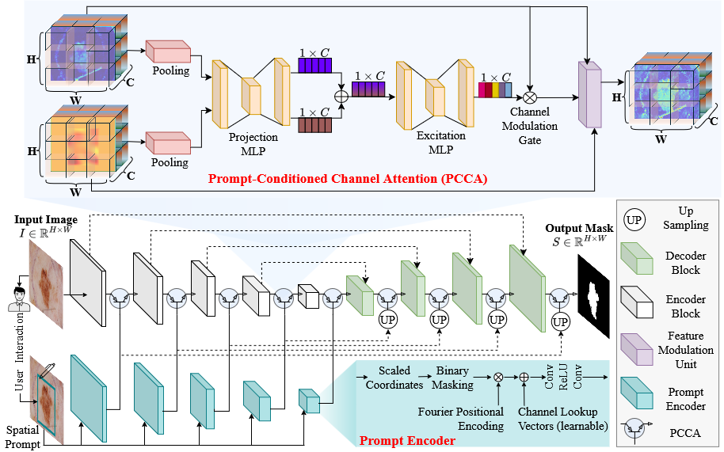

<div align="center">

# 🧠✨ PROMISE-Net  
### Prompt-Conditioned Channel Attention for Medical Image Segmentation

[](#)
[](#)
[](#)

</div>

---

## 📌 Overview

**PROMISE-Net (PROmpt Modulated Integration for SEgmentation)** is a **prompt-aware medical image segmentation framework** that introduces a novel attention mechanism called **Prompt-Conditioned Channel Attention (PCCA)**.  

The core idea is to **deeply integrate user-provided spatial prompts (e.g., bounding boxes)** into **every stage of an encoder–decoder network**, enabling **hierarchical, prompt-driven feature modulation** instead of shallow or late-stage prompt fusion.

This repository contains the **official implementation** of the models proposed in the paper:

> **“Prompt-Conditioned Channel Attention for Hierarchical Feature Modulation in Medical Image Segmentation”**

---

## 🧩 PROMISE-Net Architecture

<div align="center">
  
</div>

<p align="center">
  <em>
  PROMISE-Net framework with hierarchical Prompt-Conditioned
  Channel Attention (PCCA) integrated across encoder and decoder stages.
  </em>
</p>

---

## 🚀 Key Contributions

### 🔹 Prompt-Conditioned Channel Attention (PCCA)
- A **lightweight, channel-wise attention module**
- Conditions feature excitation on **both image features and prompt embeddings**
- Enables **prompt-aware gating** across the entire network hierarchy

### 🔹 Hierarchical Prompt Integration
- Prompts influence:
  - Early **low-level texture features**
  - Mid-level **structural representations**
  - High-level **semantic abstractions**
- Prevents loss of prompt information in deep networks

### 🔹 Cross-Architectural Generality
- Works seamlessly with:
  - **CNN-based backbones** → **PROMISE-CNN**
  - **Transformer-based backbones** → **PROMISE-Txformer**

### 🔹 Strong Generalization
- Validated across:
  - Multiple **anatomical structures**
  - Diverse **imaging modalities**
  - Binary **and** multi-class segmentation tasks

---


📌 **PCCA is inserted at *every encoder and decoder stage***, allowing prompts to continuously guide feature learning.

---

## 🏗️ Model Variants

### 🔵 PROMISE-CNN
- Based on **U-Net**
- Strong at capturing **local textures and boundaries**
- Lightweight and efficient

### 🟣 PROMISE-Txformer
- Based on **UNETR**
- Leverages **global self-attention**
- Better long-range dependency modeling

Both variants use **the same PCCA module**, demonstrating architectural flexibility.

---

## 🧪 Datasets Supported

PROMISE-Net is evaluated on **four major medical segmentation benchmarks**:

| Dataset | Task | Modality |
|------|------|------|
| 🧴 ISIC-2017 | Skin lesion segmentation | Dermoscopy |
| 🦠 Kvasir-SEG | Polyp segmentation | Endoscopy |
| 🛠️ Kvasir-Instrument | Tool segmentation | Endoscopy |
| ❤️ CAMUS | Cardiac chamber segmentation | Echocardiography |

---

## 📊 Performance Highlights

- **Consistent Dice & IoU improvements** over U-Net, UNETR, and SAM
- **Significant reduction in false negatives (FNR)**
- Improved **boundary precision (HD95)**
- Robust to:
  - Prompt perturbations
  - Inter-observer variability
  - Image quality degradation

---

## 🧠 Why PROMISE-Net?

✔ Deep prompt integration (not late fusion)  
✔ Channel-wise semantic modulation  
✔ Transformer & CNN compatible  
✔ Lightweight and scalable  
✔ Clinically reliable boundaries  

PROMISE-Net bridges the gap between **interactive segmentation** and **deep hierarchical feature learning**.

---

## 📚 Citation

If you use this code, please cite:

```bibtex
@article{PROMISENet2025,
  title={Prompt-Conditioned Channel Attention for Hierarchical Feature Modulation in Medical Image Segmentation},
  author={Mosharof Hossain, Md Rabiul Islam, Limon Halder, Md Kamrul Hasan},
  journal={IEEE},
  year={2023}
}

